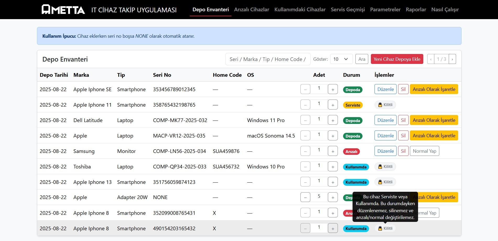
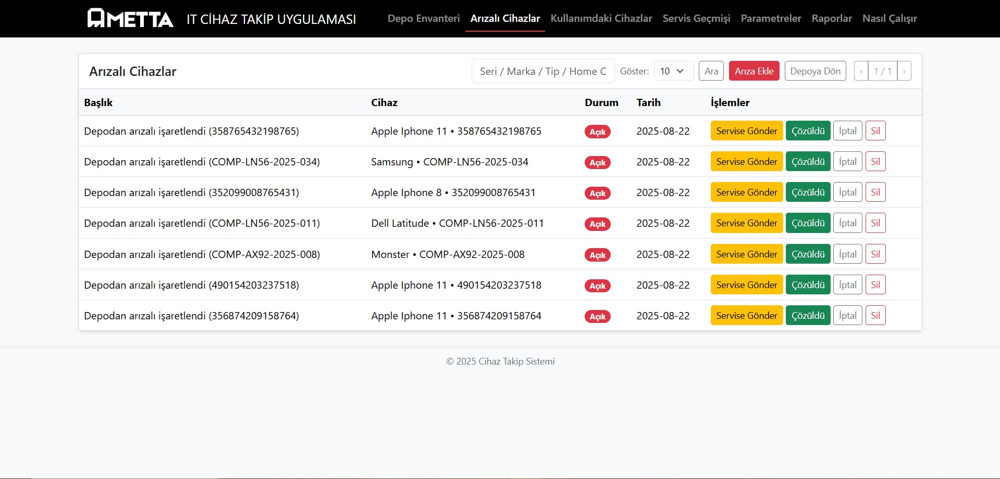
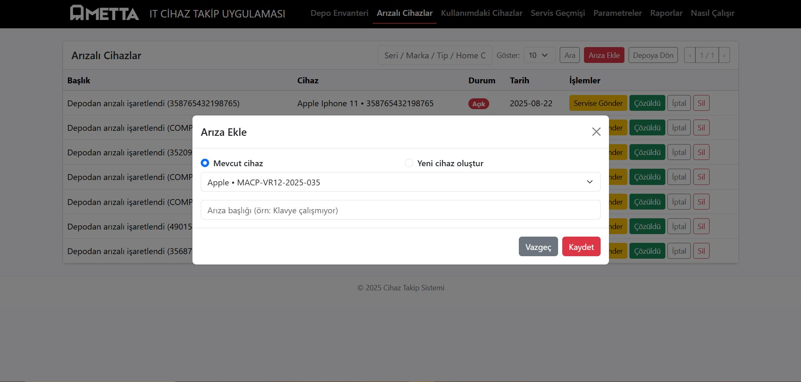
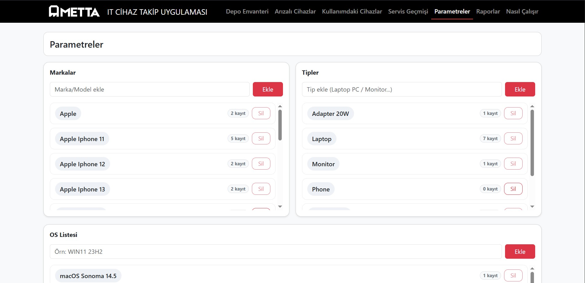
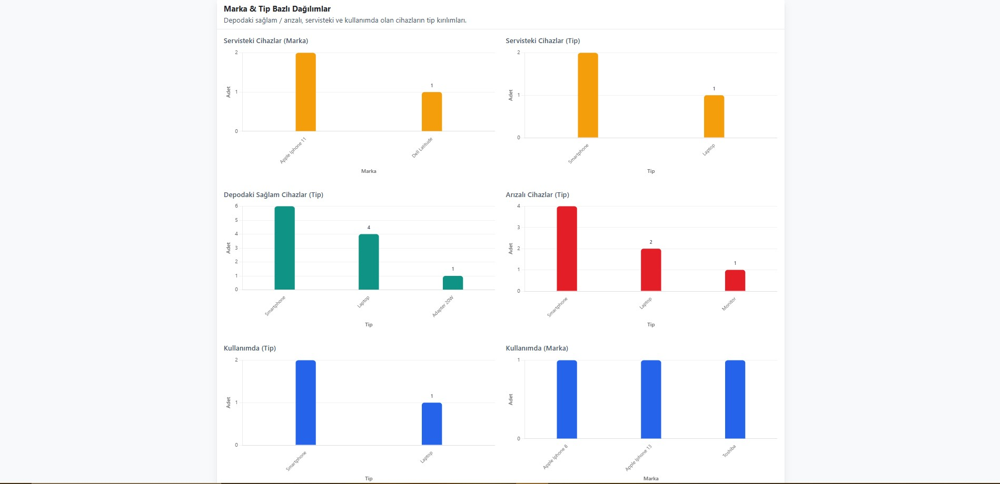
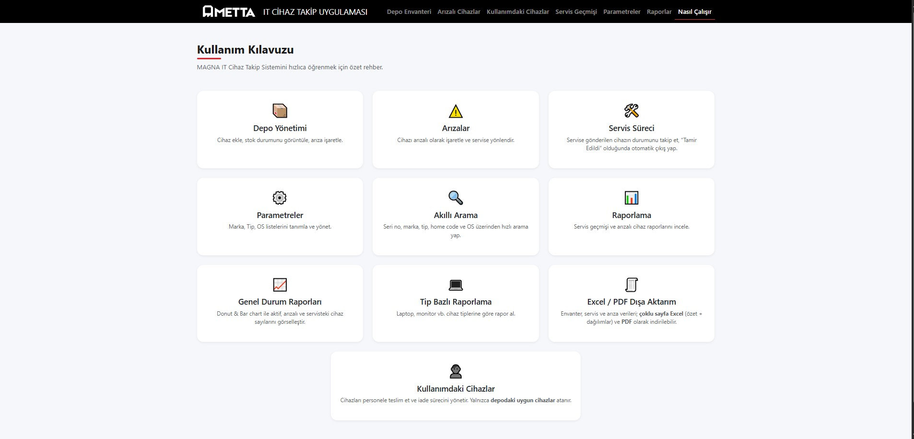

# MAGNA — IT Inventory & Service Tracking

This project is a **web-based inventory and service management system** developed to simplify the tracking of devices within the company.  
Main modules: **Inventory**, **Faulty Devices**, **Service History**, **Parameters**, **Reports**, and **User Guide**.

## 🚀 Quick Start
```bash
1. Create a virtual environment (optional but recommended)  
   `python -m venv venv`  
   - Windows: `venv\Scripts\activate`  
   - macOS/Linux: `source venv/bin/activate`  

2. Install dependencies  
   `pip install -r requirements.txt`  

3. Run the development server  
   `python app.py` → [http://127.0.0.1:5000](http://127.0.0.1:5000)

> On the first run, the `app.db` SQLite database will be created automatically.
```
## 🛠 Technologies Used
- **Backend:** Python (Flask), SQLAlchemy  
- **Frontend:** HTML5, CSS3, Bootstrap, Jinja2  
- **Database:** SQLite (default), adaptable to MSSQL/PostgreSQL  
- **Charts & Reports:** Chart.js (interactive graphs), PDF/Excel export  

## 🔑 Features

### 📦 Inventory (`/depo`)
- Add, edit, delete devices  
- Mark as Faulty / Normal  
- Track quantities  
- Search box for filtering by brand, type, serial number, etc. 

### ⚠️ Faulty Devices (`/arizali`)
- View all faulty devices  
- **“Mark as Normal”** button to restore device usability
- When a device is deleted, related **service records** are removed via cascade, while **fault records** are cleaned up manually.  
- This ensures **data integrity** and prevents database relationship errors.  

### 🛠 Service History (`/servis`)
- Add, edit, delete service records for devices  
- **Multiple open service records for the same device are not allowed**  
- **If status is set to “Repaired” or “Delivered,” the device is automatically removed from the faulty list**

### 🔍 Advanced Search & Pagination  
- On inventory, faults, and service pages, the **search bar** allows quick filtering by brand, type, serial number, home code, or operating system.  
- Results are **paginated**, and users can select the number of records per page.  

### ⚙️ Parameters (`/parametreler`)
- Manage options such as Type, Brand, Model, Operating System  
- These parameters are **automatically listed** in new device and fault entry forms (no manual typing needed)  

### 📊 Reports (`/reports`)
- Graphical reports for inventory, faulty devices, and service history  
- Category-based statistics and trend charts  
- **Export reports as PDF or Excel files** for offline use and sharing
- **PDF reports** are generated in a professional corporate layout 
- **Excel reports** are multi-sheet, including:  
  - **Summary**, **By Brand**, **By Type**, **Service Records**, and **Fault Records**.  
- Excel files automatically adjust column widths for readability  

### 📘 User Guide (`/kullanim`)
- Summary information on system usage  
- Simplified documentation page for quick onboarding  

## 🎨 Design
- **Navbar** at the top; clicking the logo redirects to the inventory page  
- Active page highlighted with a **red underline** in the navbar  
- Page navigation via the menu  
- Add/Edit modals built with **Bootstrap**  
- Reports page uses **chart.js** for interactive graphs  
- CSS kept minimal but customizable  

## 🖼️ Screenshots
> Place screenshots in the `screenshots/` folder and reference them here:

- **Inventory**  
  
  
  

- **Faulty Devices**  
  
  
  

- **In Use Devices**
  
  
  


- **Service History**  
  

- **Parameters**  
  

- **Reports**  
  
  

> You can click the "view rar" for excel file and download it but you can see PDF file when clicked it.

- **Example Reports**
  [Download Example PDF Report](screenshots/MAGNAreport.pdf)
  [Download Example Excel Report](screenshots/MAGNAreport.xlsx)

- **User Guide**  
  

## 📝 Notes
- Deletion actions require a **“Are you sure?”** confirmation  
- Built with **Flask + SQLite + SQLAlchemy**  
- Can be adapted to other databases such as **MSSQL/PostgreSQL**  
- Designed for **local use**, but can be easily deployed to a server

## 👨‍💻 Developed By
**Mehmet TAT**  
- [GitHub](https://github.com/mexmettat)  
- [LinkedIn](https://www.linkedin.com/in/mehmettat/)

## ⚠️ ATTENTION
- The company name and logo have been changed due to legal restrictions on publishing them without permission, but this application is actively used by the IT team.
